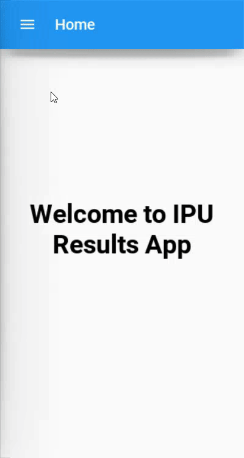

# IPUResultAndroidApp

The app fetches the data from the backend API and then it is processed to be displayed on the screen. The app is purely build using Python and Kivy with Kivymd as an enhancement over it. Kivy makes it easy to seperate betwween logic file and UI file. UI file is made using Kivy and Kivymd and logics are written in python.

## Technology Stack
- Python
- Kivy
- Kivymd
- Buildozer
- Python-to-android
- android-sdk
- REST API

## Note:
~~Currently the app doesn'nt work well in android and will crash at the startup. It will work perfectly as a windows and IOS app. I am working to fix android deployment part and hopefully the app will be available on Google Playstore soon :-)~~

The App is now converted into APK! Try it on here:
https://appetize.io/app/rva3hp233x5ccxgn7yjkwetmem?device=nexus5&scale=75&orientation=portrait&osVersion=11
